# nextwork-aws-documentation
Documentation for my AWS Project. 

# Youtube Presentation
https://youtu.be/F1gMXkIZyeU

# Part 1: Host the static website
To host a static website, we'll use the Amazon S3 service. Go to the S3 service from your console, and then follow the instructions below. 

## Step 1: Creating the bucket
Once you have clicked "Create Bucket" we recommend configuring the S3 Bucket as stated below. Note that you may want to change some settings based on your preferences. Settings that we didn't configure ourselves may show up as "User Preference". 

Settings:
- Bucket Name: [User Preference]
- AWS Region: [User Preference]
- Object Ownership: ACLs Disabled
- **Click the checkbox for the new prompt:"I acknowledge that the current settings might result in this bucket and the objects within becoming public."**

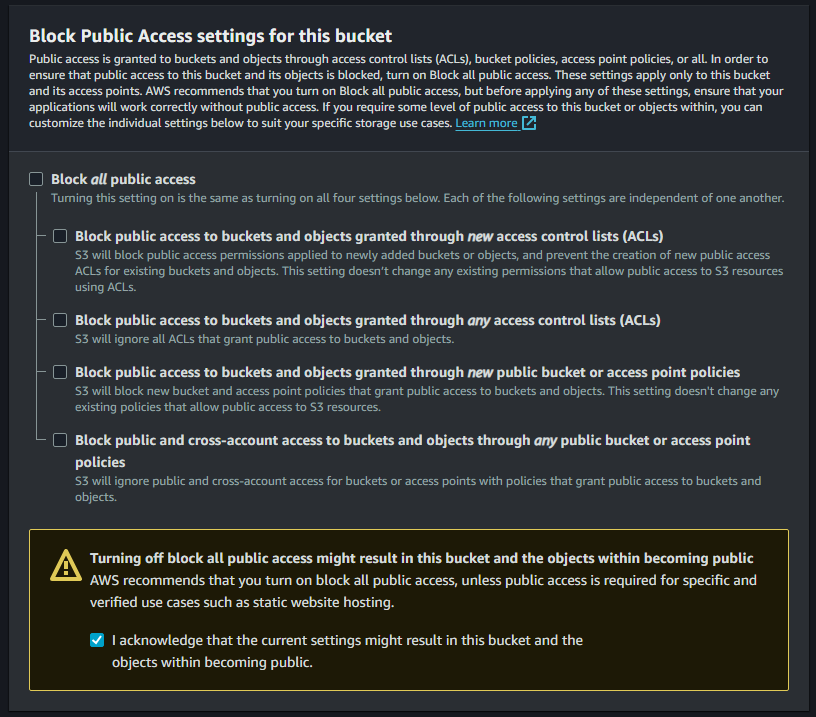

- Block all public access: Off [UNCHECK THIS]
- Bucket Versioning: [User Preference]
- Default encryption: [User Preference]
- Object Lock: [User Preference]

## Step 2: Upload website contents
After these settings were configured, go to your bucket. Click "Upload" and then upload the files/folder for the static website.  

## Step 3: Enable Static Website Hosting
Go to the "Properties" of your Bucket. Scroll down until you see "Static Website hosting" See the screenshot for reference. 

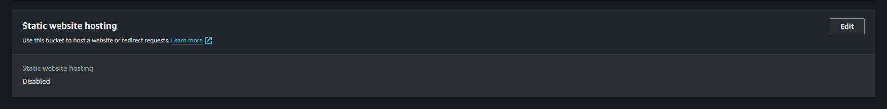

Click edit. You should now be in the "Edit Static Website Hosting" page. Configure the following settings:

- Static Website Hosting" Enable
- Hosting Type: Host a static Website
- Index Document: index.html
- Error Document: 404.html or User Preference


Click save changes. The uploading will take time based on your internet connection. Go back to the Properties and scroll down to the "Static Website Hosting" section. You should now see a link similar to "http://bucketname.s3-website-region-name.amazon.aws.com". 

Click on this link. You will now see an error page. This is because those files weren't setup for public access. 

## Step 4: Enable policies

To allow everyone with the permission to view those files, we'll now setup some policies. 

Code Version:
- Go to the "Properties tab" of your bucket and copy the "Amazon Resource Name (ARN)

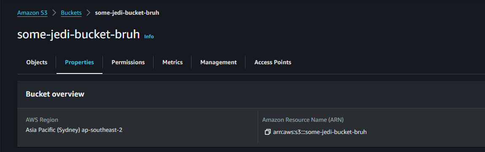

- Go the "Permissions" tab and click Edit under Bucket policy.
- Paste your ARN into the "Resource". It should look similar. Note that you will need /* right before the last double quotation mark. 

```json
{
    "Version": "2012-10-17",
    "Id": "Policy1707021805591",
    "Statement": [
        {
            "Sid": "PublicReadGetObject",
            "Effect": "Allow",
            "Principal": "*",
            "Action": "s3:GetObject",
            "Resource": "arn:aws:s3:::bucket-name/*"
        }
    ]
}
```

- Click "Save changes". Double check your Resource value if you run into errors. 

Non-Code Version:

Assuming you don't have much coding expertise, we'll setup the policies using AWS' own policy configurator tool.
- Go to: https://awspolicygen.s3.amazonaws.com/policygen.html
Configure the following:
- Select Type of Policy: S3 Bucket Policy
- Effect: Allow
- Principal: *
- AWS Service: S3 (should have been automatically selected for you)
- Actions: Select "GET OBJECT"
- Amazon Resource Name (ARN): Paste the bucket's ARN here. Add a '/*' at the end. 
- Click Add Statement. 

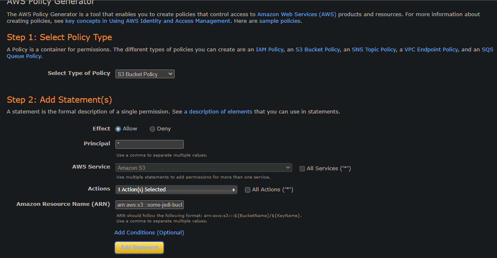

- Click Generate Policy. You should see something similar, copy all of it. You can also add the '/*' at the end of the 

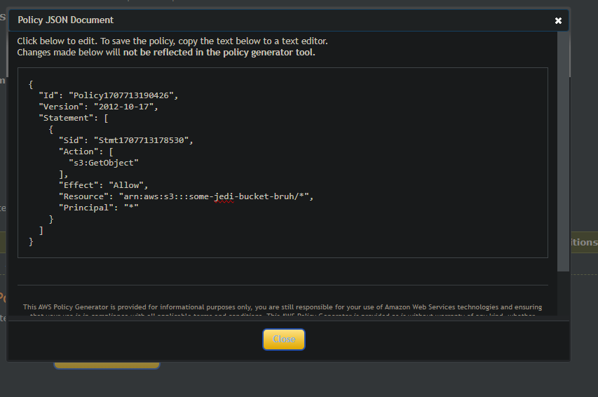

- Copy and paste it into the Policy Tab of your S3 bucket. You can find this under the Permissions tab, then Bucket Policy, Click Edit, and then paste it there. 

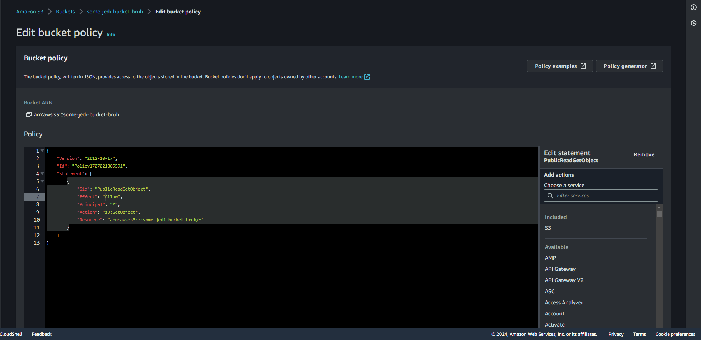

Go to the S3 Static Hosted Website link. The website should be fully up and running now. Should look like this now:

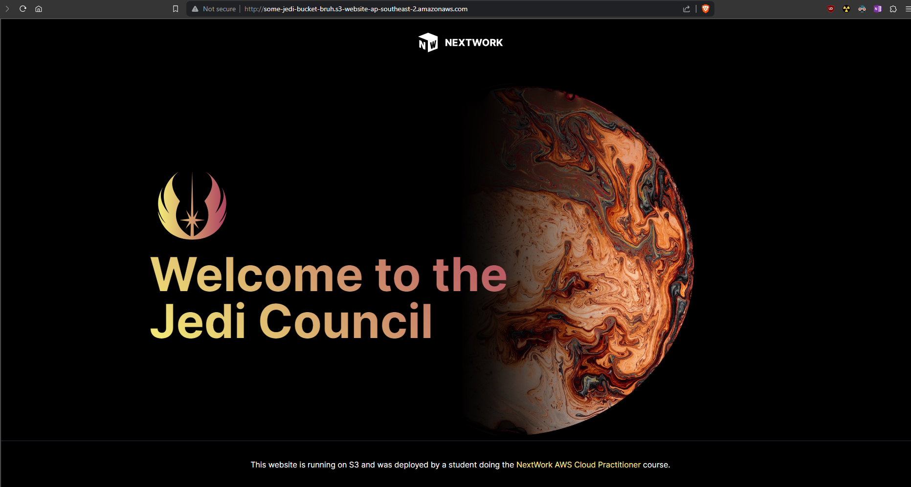

## Step 5: Cloudfront distribution

The next step is to globally distrbute our website using Amazon's CloudFront service. Head to the CloudFront console. 

- Click "Create distribution" 
- Origin Domain: Select your S3 bucket
- **You should now see a popup stating "This S3 bucket has static web hosting enabled. If you plan to use this distribution as a website, we recommend using the S3 website endpoint rather than the bucket endpoint."**
- **Click "Use website endpoint". See image below for reference**

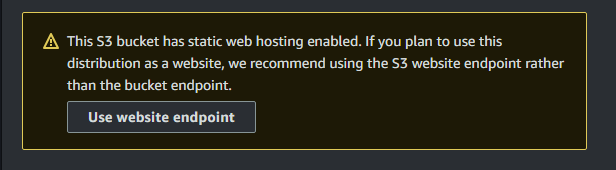

- Origin Path: [User preference]
- Name: This field should have been automatically filled if you selected the Origin Domain. 
- Web Application Firewall (WAF): Disable (Note: Enabling this will incur a charge. Enable should you need extra security provided you are willing to pay for this feature)
- Viewer protocol policy: HTTPS Only
- Allowed HTTP methods - GET, HEAD
- Create distribution

Now, go to your distribution. Under the General tab, you should now see that your distribution is now deploying. This may take upto 10 minutes. To view the distributed website, simply copy and paste the "Distribution Domain Name". See below:

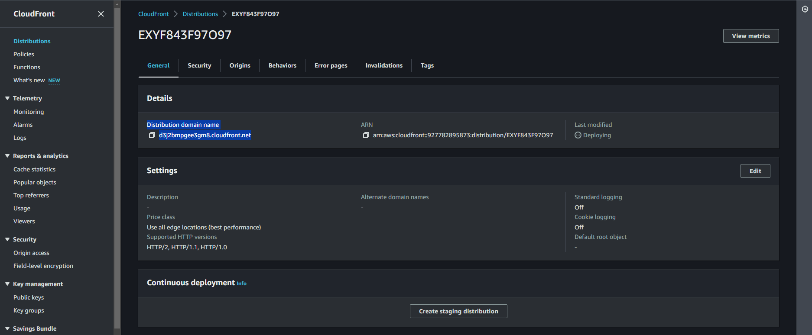

## Possible issue: Still can't view the website
If you run into a similar error when viewing your CloudFront version of the website, it's because the EndPoint wasn't setup. Error should look similar to this:

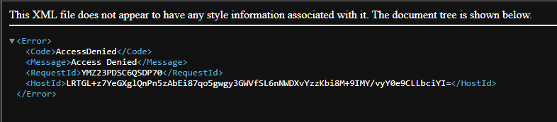

To fix this, go to the "Origins" tab in your distribution. Select your origin. Then click "Edit". 

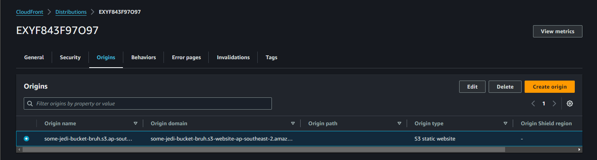

Now, you should see a yellow pop-up box with a "Use website endpoint" button. Click on it. If you don't see it, click the "X" button on the right in the "Origin Domain" selection box. 

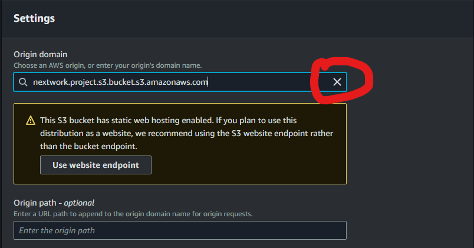

Select your S3 bucket again, then wait upto 3 seconds. You should now see the popup. Click on "Use website endpoint". 

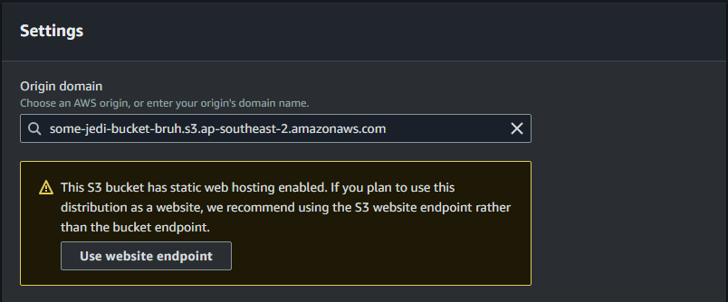

Click "save changes". Wait for your CloudFront to deploy the distrbutions again, then you should be able to see the website. 

# Part 2: VPC, Database, and Application Documentation
This will run you through on how we created Part 2 of the project. This section will include setting up a VPC, a Postgres RDS instance, and an EC2 instance with autoscaling. 

# Task 1: Create VPC.
Go to the VPC console. Now, click on "Create VPC". Follow these settings:

- Select "VPC only"
- Name the VPC: jedi-mission-vpc [or User Preference]
- IPv4 CIDR block: 192.168.0.0/18
- Create VPC

# Task 2: Create a Security Group that allows all inbound HTTP traffic and can respond to all outbound traffic.
Find the "Security Groups" tab on the left side of the console. Then, click on "Create Security Group" and configure as below:

- Security Group Name: jedi-mission-sg or User Preference
- VPC: Select the previously created "jedi-mission-vpc"
- Description: This Security Group allows all inbound HTTP traffic and can respond to all outbound traffic.
- Inbound Rule: Click "Add Rule". Under type, select "HTTP". Under Source, select "Anywhere IPv4". Follow screenshot if stuck. 
- Inbound Rule: Click "Add Rule". Under type, select "SSH". Under Source, select "Anywhere IPv4". Follow screenshot if stuck. 
- Outbound Rule: Click "Add Rule". Under type, select "All traffic". Under Source, select "Anywhere IPv4". Follow screenshot if stuck. 
- Create Security Group. 

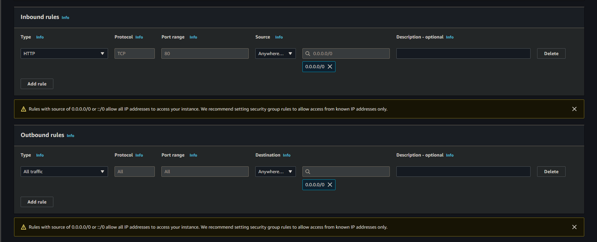

# Task 3: Create public subnets.
Go the "Subnets" menu on the left. Select "Create Subnet". 

- VPC ID: Select the "jedi-mission-vpc". 
- Subnet name: jedi-pulic-subnet
- Availability Zones: No preference 
- IPv4 Subnet CIDR block: 192.168.1.0/28
- Create subnet

# Task 4: Create internet gateway.
From the left navigation pane, select Internet gateways. Click on "Create Internet Gateway". Configure these settings:

- Name: jedi-mission-igw
- After creating this IGW. 
- Select this IGW, then find "Actions". 
- Click on actions, then select "Attach to VPC". 
- Select the jedi-mission-vpc 


# Task 5: Create public route tables.
In the left pane, select Route Tables. Click "Create Route Table". Configure these settings:

- Name: jedi-mission-rt
- VPC: Choose the jedi-mission vpc
- Create Route Table
- Navigate back to the Route tables section on the left navigation area. Select (check the box next to) the "jedi-mission-rt", scroll to the bottom, and select the Routes tab. Select the Edit routes button located in the routes box.
- Select Add route
- In the Destination section, type 0.0.0.0/0 in the search box. This is the route to the IGW. You are telling the route table that any traffic that needs an internet connection will use 0.0.0.0/0 to reach the IGW therefore it can reach the internet.
- Click in the Target section and select Internet Gateway since you are targeting any traffic that needs to go to the internet to the IGW. Once you select the IGW, click the box with the text igw-, and you will see your jedi-mission-vpc appear. Select that IGW. Select Save changes.
- From the route table dashboard (the page you're automatically on), select the Subnet associations tab. Select the Edit subnet associations button.
- Select the "jedi-pulic-subnet" subnet and choose Save association.

# Task 6: Launch EC2 Instance
Go to the EC2 console. Configure as follows:

- Name: jedi-mission-logs
- AMI: Amazon Linux (64-bit architecture)
- Instance Type: t2.micro
- Key Pair: Create new key pair (save this for later)
- Under "Network Settings", click "EDIT". 
- VPC: Select jedi-misison-vpc
- Subnet: The public jedi subnet should have been automatically selected for you. 
- Auto-assign Public IP: Yes
- Security Group: Select existing, then select the jedi-mission-sg
- Storage: 8GB or User Preference
- Launch Instance

Note down the Key Pair and the public IPV4 address of your EC2 instance. We'll need this later after the database is setup. 

# Task 7: Setup the database. 

Go to RDS. Select "Create Database". Configure as follows:

- Choose a database creation method: Standard
- Engine: Postgres
- Templates: Free Tier
- DB instance identifier: db-jedi-mission-logs
- Under credentials:
- Master username: Setup yourself
- Master password: Setup yourself. 
- Under Connectivity:
- Connect to an EC2 compute resource
- EC2 instance : Select the jedi-mission-log EC2 instance
- VPC: jedi-mission-vpc (or it will be auto-selected to this one already)
- DB subnet group: Automatic setup
- Create new VPC Security Group: name it yourself, or call it postgres-rds-ec2-sg
- Create Database

Note down the Endpoint and port of your database. We'll need this later. 

# Task 8: Setup the EC2 instance to connect with the Database. 
Connect to your instance by right clicking the instance from the instances list and choosing connect. This involves creating an SSH session to the virtual machine.

- Run the commands

```sudo yum update
sudo yum install docker
sudo usermod -a -G docker ec2-user
sudo systemctl enable docker.service
```

- Verify docker is running with docker --version
- run `docker pull public.ecr.aws/z7j4c9h0/nextwork/coursework/real-world-projects/jedi-mission-logs:latest`

- Now, edit this link to include your RDS username and password here, as well as the DB instance in this link:

- `docker run -d -p 80:3000 -e DATABASE_URL=postgres://postgres:<your password here>@<DB instance URL here>:5432/jedi-mission-logs public.ecr.aws/z7j4c9h0/nextwork/coursework/real-world-projects/jedi-mission-logs:latest`

# Task 9: Create Image and autoscaling
Now, we'll setup autoscaling groups. 

- From your instance, select the checkbox and click "Actions". 
- Select "Image and Templates", then "Create Image". 
- Image Name: jedi-mission-logs-image
- Description: An image of the currently running jedi-mission-logs application. 

We've created an image of our EC2 instance. Let's move onto creating a launch template now. This is specifically for our auto-scaling groups. 

- Create image
- From your instance, select the checkbox and click "Actions". 
- Select "Image and Templates", then "Create template from instance". 
- Name: jedi-mission-log-launch-template
- Description: Template of our 
- Auto Scaling Guidance: Click the checkbox on this. It should read "Provide guidance to help me set up a template that I can use with EC2 Auto Scaling"
- Launch Template Contexts
- Application and OS Images: Select "My AMIs". Then select the "jedi-mission-logs-image" we created earlier. 
- Instance type: t2.micro
- Key pair (login): Don't include in launch template
- Security Group: Select existing group, select the jedi-security group. 
- User data: Paste the following:
```
#!/bin/bash
docker pull public.ecr.aws/z7j4c9h0/nextwork/coursework/real-world-projects/jedi-mission-logs:latest
docker run -d -p 80:3000 -e DATABASE_URL=postgres://postgres:<your password here>@<DB instance URL here>:5432/jedi-mission-logs public.ecr.aws/z7j4c9h0/nextwork/coursework/real-world-projects/jedi-mission-logs:latest
```

Now go to the "Auto-Scaling Groups" on the left menu navigation and then click on Create AutoScaling Group. 

- Name: jedi-mission-auto-scaling-group
- Launch Template: jedi-mission-log-launch-template
- Click Next
- VPC: Select jedi vpc
- Availability Zones and subnets: choose the jedi-mission-subnet and the private subnet
- Click next
- Load Balancing: User preference, this does cost a few cents a month. For now, we've turned this off. 
- VPC Lattice: No
- Monitoring: Optional but we recommend turning this on. 
- Click next
- Group Size: 1 (or 2)
- Scaling: Minimum: 0, Maximum: 5
- Automatic Scaling: Set to "Target tracking scaling policy". 
- Metric Type: Average CPU utilization
- Target Value: 50
- Instance maintenance policy: Control Costs (Terminate and Launch)
- Skip next on the "add notifications" page
- Add a tag
- Key: Enter instance name
- Value: Enter instance id
- Click create autoscaling group

# Task 10: Enjoy! And limitations

That's it. That's how we created this project. Here's what we didn't implement, that you usually would in the real world:

- A custom domain name hosted in Route53.
- TLS encryption (HTTPS) and an SSL certificate issued by ACM.
- A CDN to prevent DDoS or malicious users accessing the Mission Logs application.
- The Mission Logs application running inside an ECS cluster.
- A load balancer routing traffic from the domain name to ECS.